# Tally Prime Accounting System

## Project Overview

This project demonstrates a complete accounting system developed using **Tally Prime EDU**. It includes company creation, inventory management, accounting vouchers, financial reporting, and outstanding debtor/creditor management for **XYZ Electronics Traders**.

---

## Features

* Company Creation
* Chart of Accounts
* Stock Item Management
* Capital Introduction
* Purchase Voucher Entry
* Sales Voucher Entry
* Receipt Voucher Entry
* Payment Voucher Entry
* Stock Summary
* Outstanding Debtors
* Outstanding Creditors
* Profit and Loss Account
* Balance Sheet

---

## Repository Contents

* Project Screenshots (.png)
* Tally Backup File (`TDBK1800_100000.001`)

---

## Software Used

* Tally Prime EDU
* GitHub

---

# Project Screenshots

## Company Dashboard

**File:** `Company_Dashboard.png`

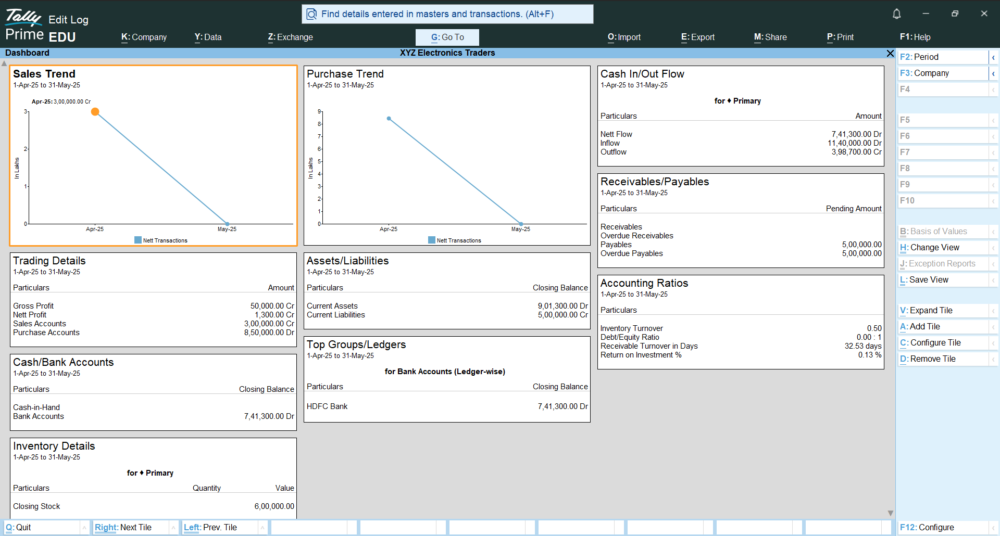

---

## Chart of Accounts

**File:** `Chart_of_Accounts.png`

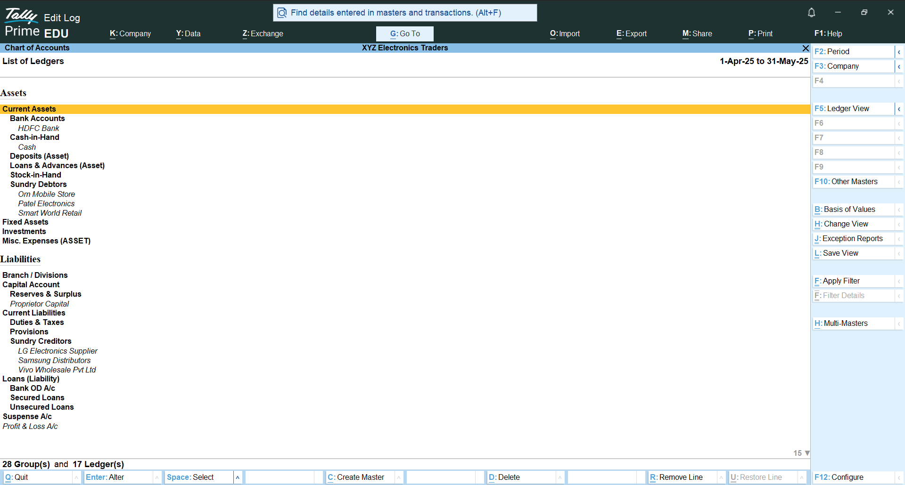

---

## Stock Items

**File:** `Stock_Items.png`

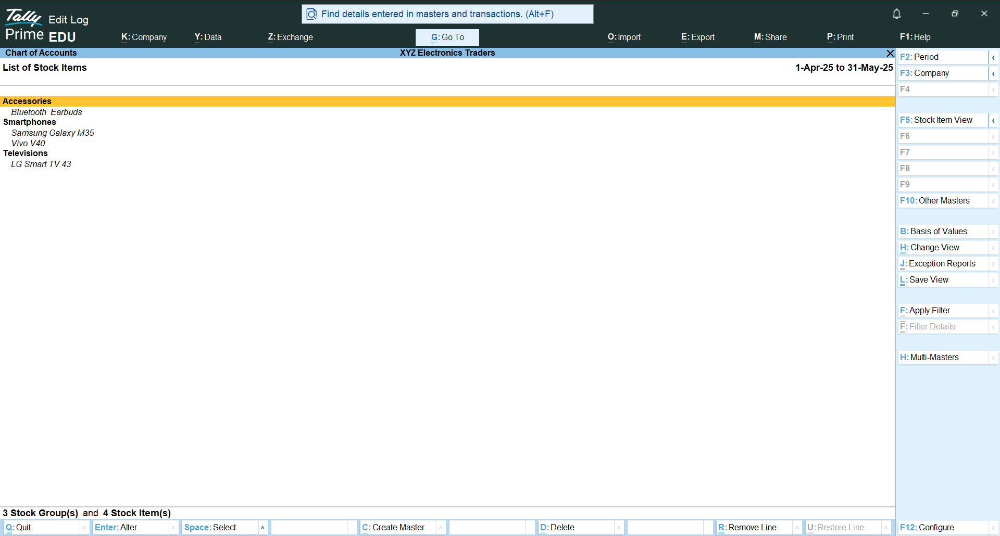

---

## Capital Introduction Voucher

**File:** `Capital_Introduction_Voucher.png`

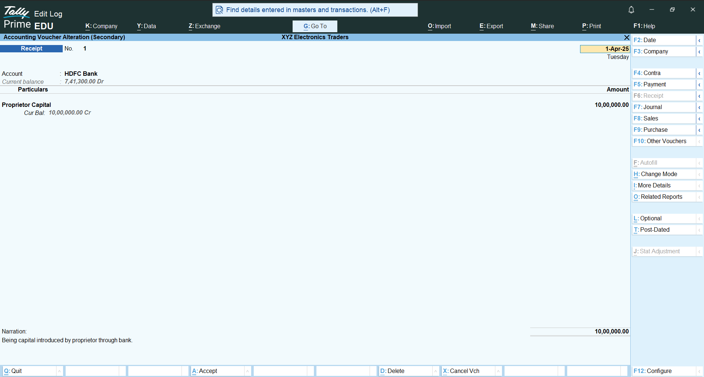

---

## Purchase Voucher – Samsung Distributors

**File:** `Purchase_Voucher_Samsung_Distributors.png`

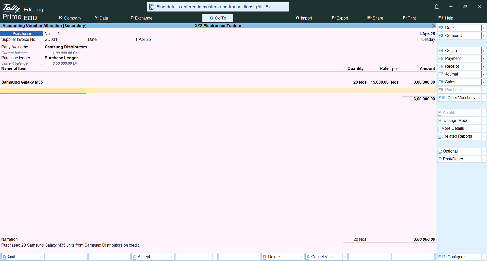

---

## Purchase Voucher – LG Electronics Supplier

**File:** `Purchase_Voucher_LG_Electronics_Supplier.png`

---

## Purchase Voucher – Vivo Wholesale Pvt Ltd

**File:** `Purchase_Voucher_Vivo_Wholesale.png`

---

## Sales Voucher – Patel Electronics

**File:** `Sales_Voucher_Patel_Electronics_1.png`

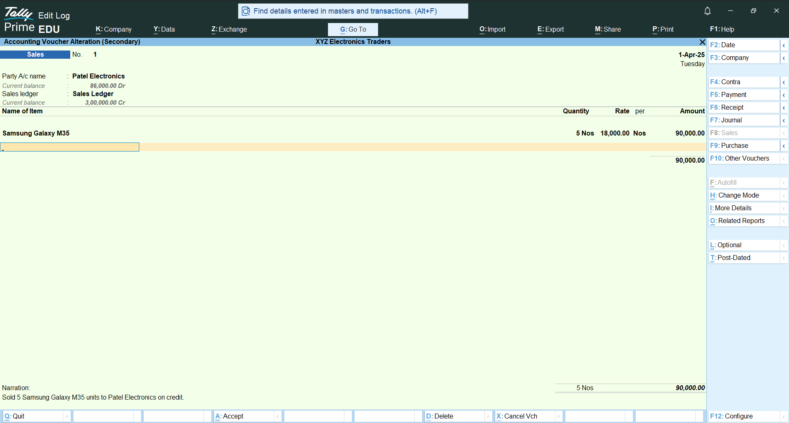

---

## Sales Voucher – Om Mobile Store

**File:** `Sales_Voucher_Om_Mobile_Store.png`

---

## Sales Voucher – Smart World Retail

**File:** `Sales_Voucher_Smart_World_Retail.png`

---

## Receipt Voucher – Patel Electronics

**File:** `Receipt_Voucher_Patel_Electronics.png`

---

## Payment Voucher – Samsung Distributors

**File:** `Payment_Voucher_Samsung_Distributors.png`

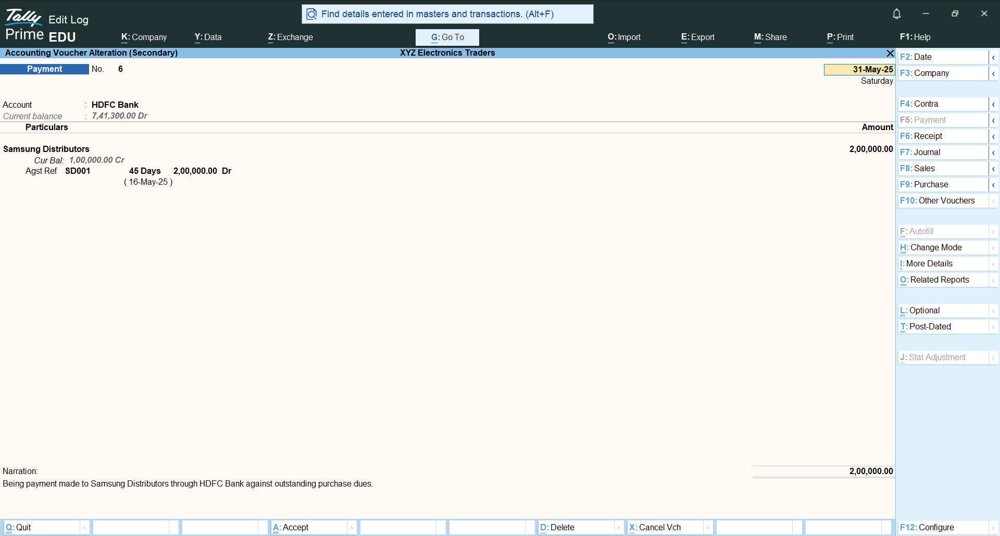

---

## Stock Summary

**File:** `Stock_Summary.png`

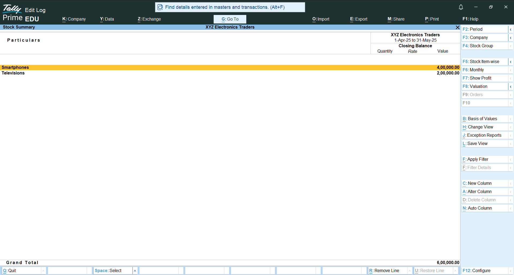

---

## Outstanding Debtors

**File:** `Outstanding_Debtors.png`

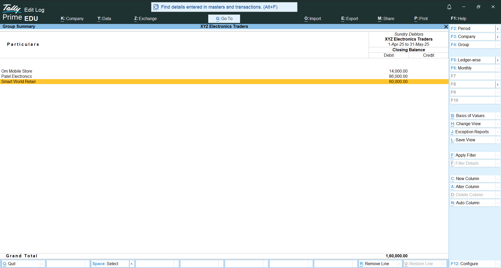

---

## Outstanding Creditors

**File:** `Outstanding_Creditors.png`

---

## Profit and Loss Account

**File:** `Profit_and_Loss.png`

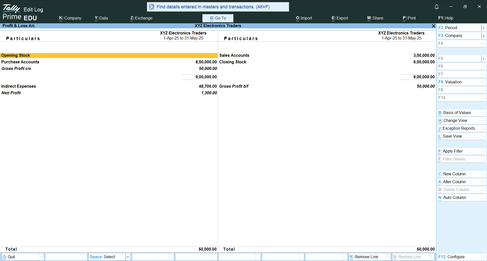

---

## Balance Sheet

**File:** `Balance_Sheet.png`

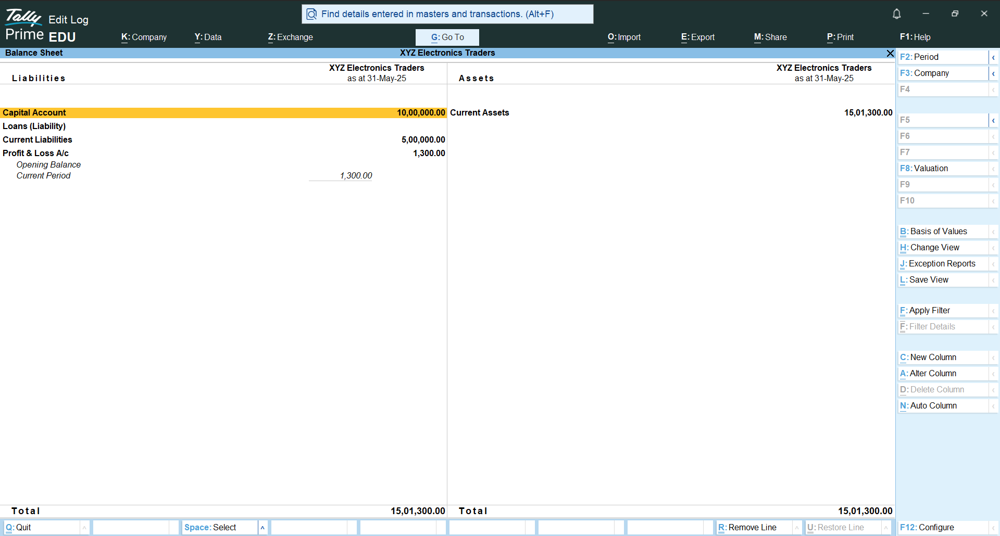
